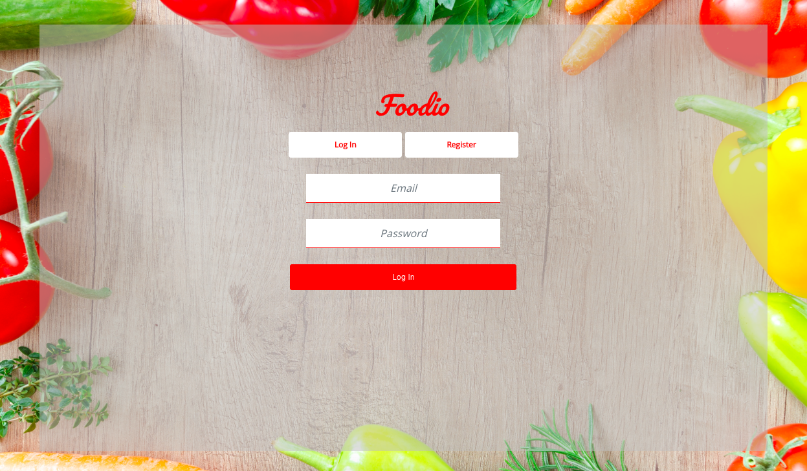
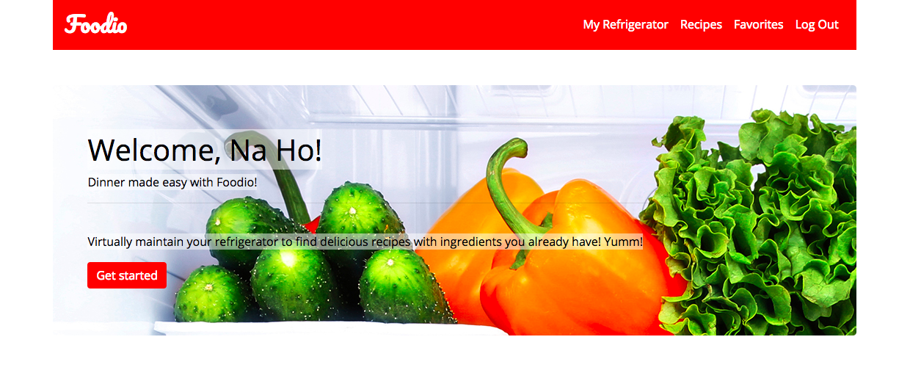
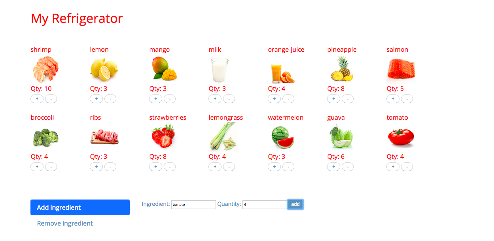
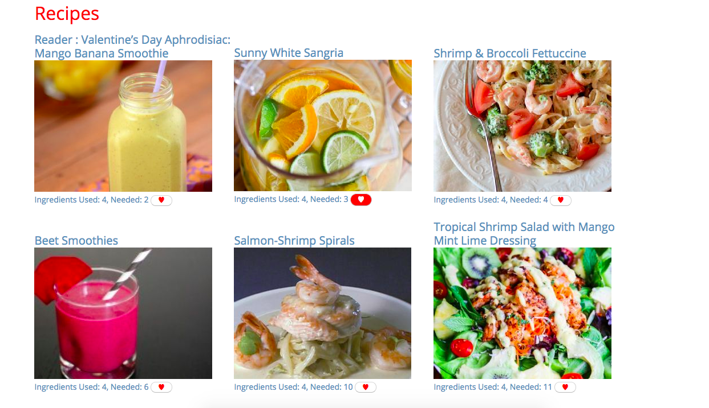
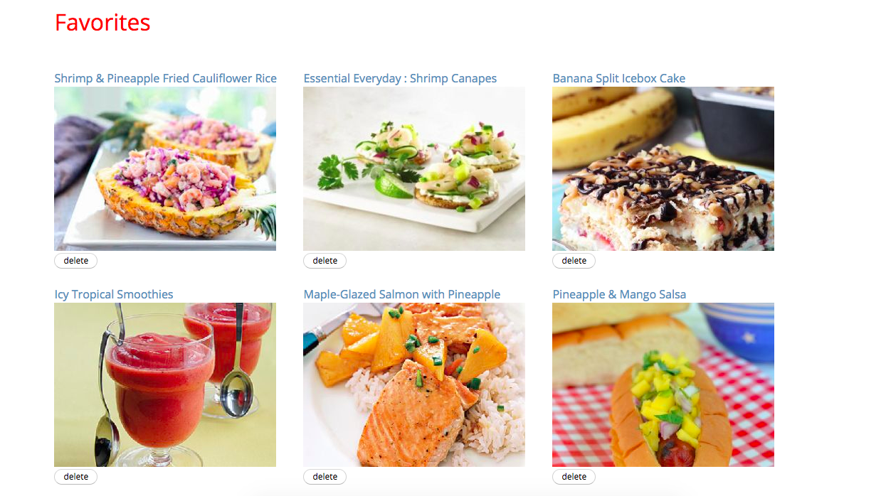

# Foodio

### Summary
Foodio is a web application that solves the problem of deciding what to cook for dinner by creating a virtual refrigerator that maintains food inventory and populates recipes based on those ingredients.

### About the Developer
Foodio was created by Na Ho, a software engineer in San Francisco, CA.  
More information can be found on [LinkedIn](https://www.linkedin.com/in/na-ho/)

### Technologies
Python 
Flask 
JavaScript (jQuery & Ajax)  
HTML, Jinja, CSS, Bootstrap 
PostgreSQL, SQLAlchemy

### Features
Maintain refrigerator contents by adding/removing ingredients and updating food quantities

 
Populates recipes based on user's ingredients

 
Bookmark favorite recipes

### Version 2.0
Create a shopping list users can send to themselves via SMS 
Recipe recommendations
